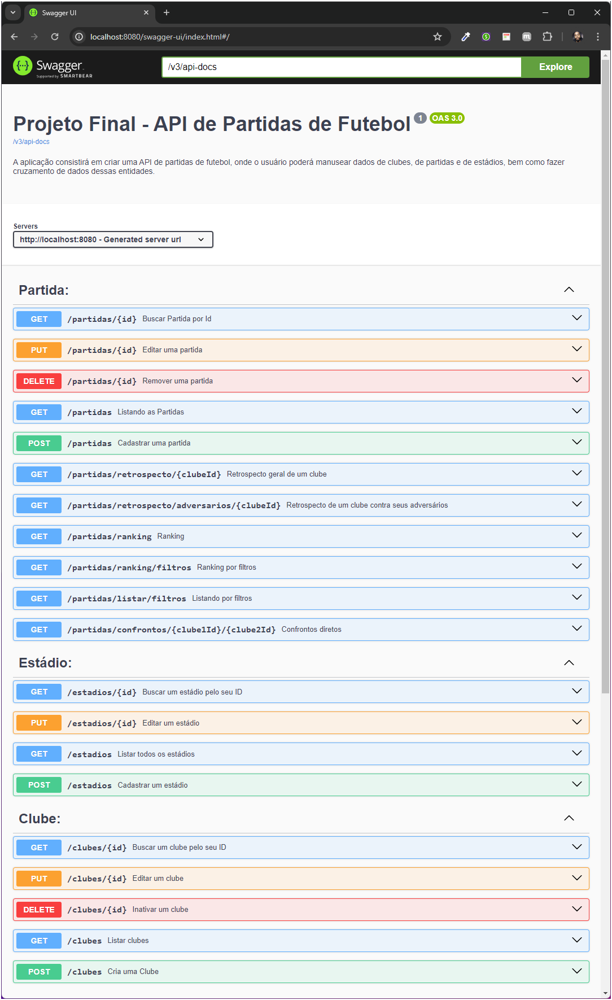
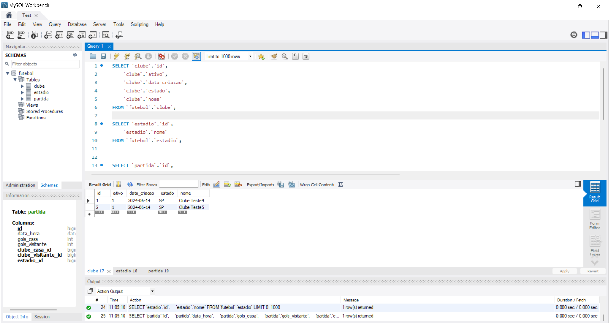
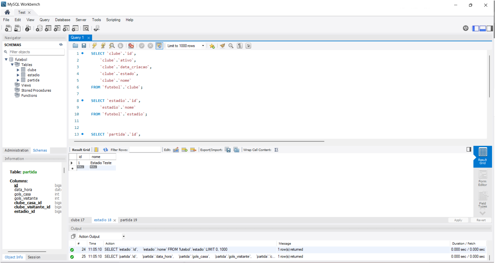
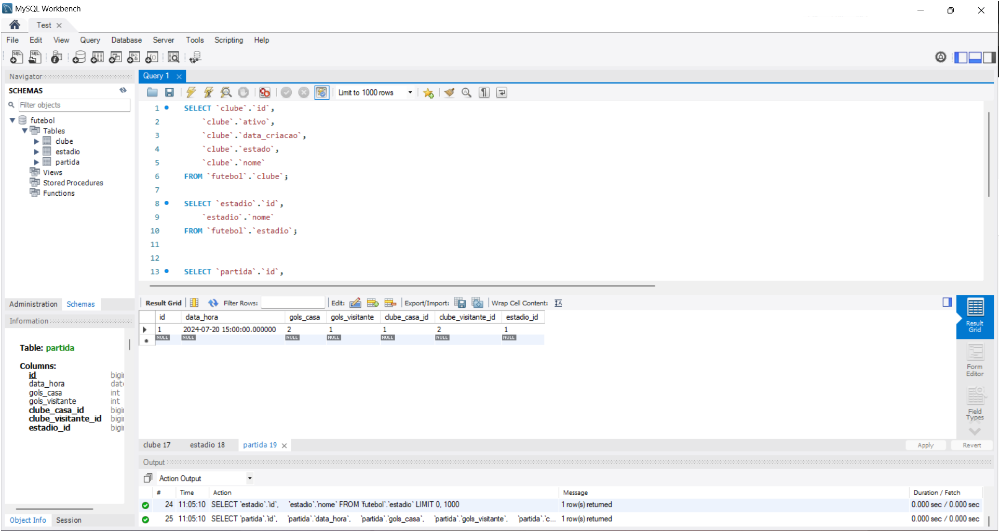

# Projeto Final - API de Partidas de Futebol

## Apresentação

A aplicação consistirá em criar uma API de partidas de futebol, onde o usuário poderá manusear dados de clubes, de partidas e de estádios, bem como fazer cruzamento de dados dessas entidades.

## Requisitos Não-Funcionais

1. A aplicação deverá usar linguagem de programação Java versão 17 ou superior, com framework Spring Boot e Spring Data.
2. A aplicação deverá utilizar MySQL como banco de dados.
3. O código deverá estar hospedado no GitHub.

## Requisitos Funcionais Mínimos

### 1. Cadastrar um Clube
- **Método:** POST
- **Retorno Esperado:** 201 CREATED
- **Cenários de Exceção:**
    - Dados inválidos: 400 BAD REQUEST
    - Conflito de dados: 409 CONFLICT

### 2. Editar um Clube
- **Método:** PUT
- **Retorno Esperado:** 200 OK
- **Cenários de Exceção:**
    - Dados inválidos: 400 BAD REQUEST
    - Data inválida: 409 CONFLICT
    - Conflito de dados: 409 CONFLICT
    - Clube não existe: 404 NOT FOUND

### 3. Inativar um Clube
- **Método:** DELETE
- **Retorno Esperado:** 204 NO CONTENT
- **Cenários de Exceção:**
    - Clube não existe: 404 NOT FOUND

### 4. Buscar um Clube
- **Método:** GET
- **Retorno Esperado:** 200 OK
- **Cenários de Exceção:**
    - Sem resultado: 404 NOT FOUND

### 5. Listar Clubes
- **Método:** GET
- **Retorno Esperado:** 200 OK
- **Cenários de Exceção:**
    - Sem resultado: Lista vazia com status 200 OK

### 6. Cadastrar uma Partida
- **Método:** POST
- **Retorno Esperado:** 201 CREATED
- **Cenários de Exceção:**
    - Dados inválidos: 400 BAD REQUEST
    - Data inválida: 409 CONFLICT
    - Clube inativo: 409 CONFLICT
    - Partidas com horários próximos: 409 CONFLICT
    - Estádio já possui jogo: 409 CONFLICT

### 7. Editar uma Partida
- **Método:** PUT
- **Retorno Esperado:** 200 OK
- **Cenários de Exceção:**
    - Dados inválidos: 400 BAD REQUEST
    - Data inválida: 409 CONFLICT
    - Clube inativo: 409 CONFLICT
    - Partidas com horários próximos: 409 CONFLICT
    - Estádio já possui jogo: 409 CONFLICT
    - Partida não existe: 404 NOT FOUND

### 8. Remover uma Partida
- **Método:** DELETE
- **Retorno Esperado:** 204 NO CONTENT
- **Cenários de Exceção:**
    - Partida não existe: 404 NOT FOUND

### 9. Buscar uma Partida
- **Método:** GET
- **Retorno Esperado:** 200 OK
- **Cenários de Exceção:**
    - Sem resultado: 404 NOT FOUND

### 10. Listar Partidas
- **Método:** GET
- **Retorno Esperado:** 200 OK
- **Cenários de Exceção:**
    - Sem resultado: Lista vazia com status 200 OK

### 11. Cadastrar um Estádio
- **Método:** POST
- **Retorno Esperado:** 201 CREATED
- **Cenários de Exceção:**
    - Dados inválidos: 400 BAD REQUEST
    - Estádio já existe: 409 CONFLICT

### 12. Editar um Estádio
- **Método:** PUT
- **Retorno Esperado:** 200 OK
- **Cenários de Exceção:**
    - Dados inválidos: 400 BAD REQUEST
    - Estádio já existe: 409 CONFLICT
    - Estádio não existe: 404 NOT FOUND

### 13. Buscar um Estádio
- **Método:** GET
- **Retorno Esperado:** 200 OK
- **Cenários de Exceção:**
    - Sem resultado: 404 NOT FOUND

### 14. Listar Estádios
- **Método:** GET
- **Retorno Esperado:** 200 OK
- **Cenários de Exceção:**
    - Sem resultado: Lista vazia com status 200 OK

## Buscas Avançadas

### 1. Retrospecto Geral de um Clube
- **Método:** GET
- **Retorno Esperado:** 200 OK
- **Cenários de Exceção:**
    - Sem resultado: Retrospecto zerado com status 200 OK
    - O clube não existir: 404 NOT FOUND

### 2. Retrospecto de um Clube Contra Seus Adversários
- **Método:** GET
- **Retorno Esperado:** 200 OK
- **Cenários de Exceção:**
    - Sem resultado: Lista vazia com status 200 OK
    - O clube não existir: 404 NOT FOUND

### 3. Confrontos Diretos
- **Método:** GET
- **Retorno Esperado:** 200 OK
- **Cenários de Exceção:**
    - Sem resultado: Lista vazia com retrospecto zerado e status 200 OK
    - Não existir um dos clubes: 404 NOT FOUND

### 4. Ranking
- **Método:** GET
- **Retorno Esperado:** 200 OK
- **Cenários de Exceção:**
    - Sem resultado: Lista vazia com status 200 OK

## Filtros Avançados

1. **Goleadas:** Nos endpoints que retornam resultados de partidas, o usuário poderá aplicar um filtro de partidas em que ocorreram goleadas (diferença igual ou superior a 03 gols para um dos clubes).
2. **Mandantes e Visitantes:** Nos endpoints que retornam dados de clubes específicos, o usuário poderá aplicar um filtro de partidas em que o clube jogou como mandante ou como visitante.

# Instalação da aplicação

Primeiramente, faça o clone do repositório:
```
git clone https://github.com/daniellimadev/API-de-Partidas-de-Futebol.git
```
Feito isso, acesse o projeto:
```
cd API-de-Partidas-de-Futebol
```
Para dar o start da aplicação com banco de dados no docker executar o comando abaixo:
```
docker-compose up -d
```
E depois da um docker ps para lista todos os containers em execução.

```
docker ps
```
E depois da um docker stop seguido ID da imagem api-de-partidas-de-futebol-app
```
docker stop Id
```
E depois da um docker ps para ver que só o container do banco de dados esta rodando. 

```
docker ps
```

É preciso compilar o código e baixar as dependências do projeto:
```
mvn clean package
```
Finalizado esse passo, vamos iniciar a aplicação:
```
mvn spring-boot:run
```

# Setup da aplicação com docker

## Pré-requisito

Antes de rodar a aplicação é preciso garantir que as seguintes dependências estejam corretamente instaladas:

```
Java 21
Docker
Maven
```

Para fazer o docker build executar o comando abaixo:
```
docker build -t api-de-partidas-de-futebol .
```
Para dar o start da aplicação no docker executar o comando abaixo:
```
docker-compose up -d
```

## documentação com Swagger
A documentação do Swagger está disponível em http://localhost:8080/swagger-ui/index.html

🖼Screenshot
Swagger



DB-CLUBE



DB-ESTADIO



DB-PARTIDA



## Para testa a API no Postman

Para testa a Api os endpoints no postmam, só dar um import do arquivo TESTE-API-de-Partidas-de-Futebol-NO-POSTMAN.postman_collection.json na pasta [PROJETO-FINAL](PROJETO-FINAL)


<h3>Autor</h3>

<a href="https://www.linkedin.com/in/danielpereiralima/">
 

Feito por Daniel Pereira Lima 👋🏽 Contato!

[](https://www.linkedin.com/in/danielpereiralima/)